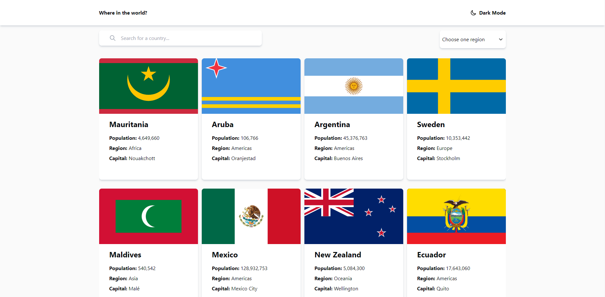
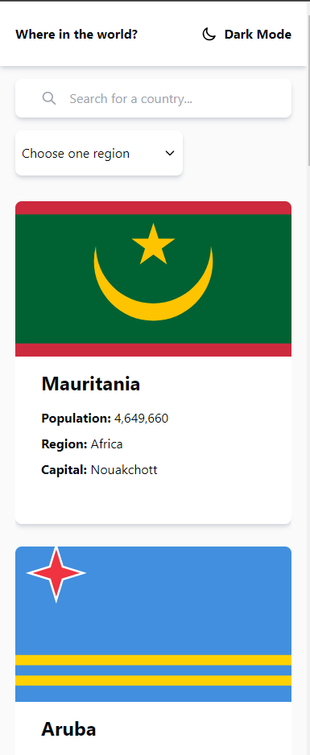

# Rest Countries API NEXT JS | _FrontendMentor_

### Screenshot




### Links

- Solution URL: [https://www.frontendmentor.io/solutions/flags-challenge-with-react-aKQGkOCW8P](https://www.frontendmentor.io/solutions/flags-challenge-with-react-aKQGkOCW8P)
- Live Site URL: [https://countryflagsfrontendmentor.netlify.app/#/flags](https://countryflagsfrontendmentor.netlify.app/#/flags)

```js
const showMessage = () => {
  console.info("Happy Coding 💻");
};

showMessage();
```

### Built with

- Next Js
- Tailwind CSS

## Author

- Frontend Mentor - [@RaulTC](https://www.frontendmentor.io/profile/Raul-TC)
